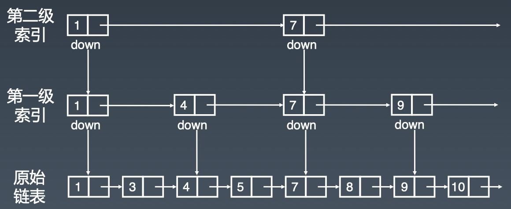

# 数组、链表

## 总结
1. 一维数据结构加速通常需要升为二维

## 数组、链表、调表

### 数组

### 链表

head -> node -> tail

### 跳表
1. 链表元素是有序的
2. 出现的很晚（1990年）
3. 对标平衡二叉搜索树「AVL Tree」和二分查找
4. 原理简单、容易实现、方便扩展、效率更高
5. 新的项目均使用跳表替代平衡二叉搜索树
6. 空间复杂度是O(n)，但是实际复杂度大于原链表

### 复杂度

| 数组 | 时间复杂度 | 空间复杂度 |
|---|---|---|
| 插入删除 | O(n) | O(n) |
| 随机访问 | O(1) | O(n) |

| 链表 | 时间复杂度 | 空间复杂度 |
|---|---|---|
| 插入删除 | O(1) | O(n) |
| 随机访问 | O(n) | O(n) |

| 跳表 | 时间复杂度 | 空间复杂度 |
|---|---|---|
| 插入删除 | O(log n) | O(n) |
| 搜索 | O(log n) | O(n) |

### LeetCode

#### 数组
| 题目 | 项目链接 | leetcode |
|---|---|---|
| 26. 删除排序数组中的重复项 | [RemoveDuplicatesFromSortedArray](leetcode/RemoveDuplicatesFromSortedArray.java) | [remove-duplicates-from-sorted-array](https://leetcode-cn.com/problems/remove-duplicates-from-sorted-array/) |
| 1. 两数之和 | [TwoSum](leetcode/TwoSum.java) | [two-sum](https://leetcode-cn.com/problems/two-sum/) |
| 15. 三数之和 | [ThreeSum](leetcode/ThreeSum.java) | [3sum](https://leetcode-cn.com/problems/3sum/) |
| 283. 移动零 | [MoveZeroes](leetcode/MoveZeroes.java) | [move-zeroes](https://leetcode-cn.com/problems/move-zeroes/) |
| 11. 盛最多水的容器 | [ContainerWithMostWater](leetcode/ContainerWithMostWater.java) | [container-with-most-water](https://leetcode-cn.com/problems/container-with-most-water/) |
| 70. 爬楼梯 | [ClimbingStairs](leetcode/ClimbingStairs.java) | [climbing-stairs](https://leetcode-cn.com/problems/climbing-stairs/) |
|---|||
| 16. 最接近的三数之和 | [ThreeSumClosest](leetcode/ThreeSumClosest.java) | [3sum-closest](https://leetcode-cn.com/problems/3sum-closest/) |
| 18. 四数之和 | [FourSum](leetcode/FourSum.java) | [4sum](https://leetcode-cn.com/problems/4sum/) |
|  |  |  |

#### 链表
| 题目 | 项目链接 | leetcode |
|---|---|---|
| 206. 反转链表 | [ReverseLinkedList](leetcode/ReverseLinkedList.java) | [reverse-linked-list](https://leetcode-cn.com/problems/reverse-linked-list/) |
|  |  |  |

### 参考资料
[LRU缓存算法](https://www.jianshu.com/p/b1ab4a170c3c)
[Redis 跳表实现](https://redisbook.readthedocs.io/en/latest/internal-datastruct/skiplist.html)
